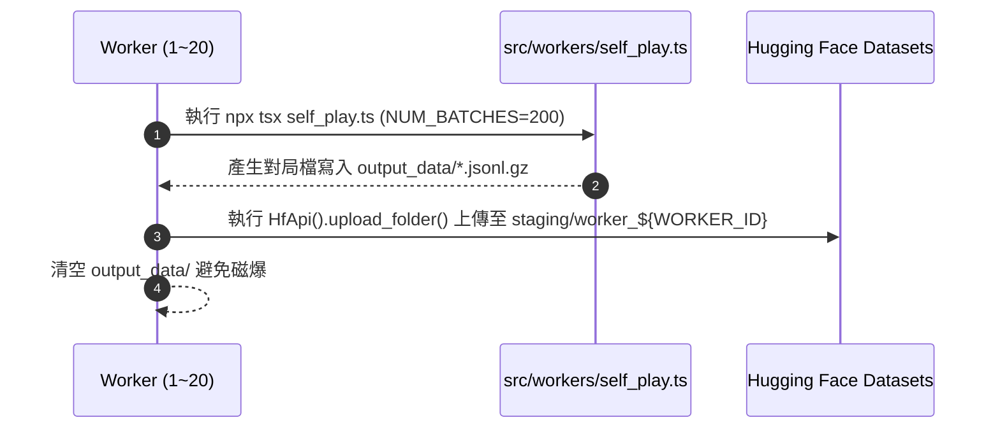
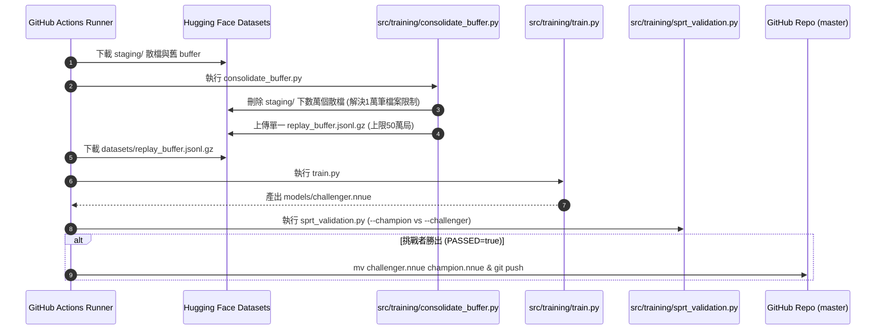

# 07. GitHub Actions 執行流程與腳本對照 (Actions & Scripts Reference)

本文件詳細記載 DarkChess (NNUE) 專案中，所有 **GitHub Actions 工作流 (.yml)** 的觸發時機、執行順序、涉及之**腳本檔 (.ts / .py)**、輸入輸出路徑以及外部雲端資料庫（Hugging Face / GitHub Repository）的交集處理細節。

---

## 🧭 系統三大 GitHub Actions 工作流概覽

| Workflow 檔名 | 工作流名稱 | 觸發時機 | 主要任務與目標 |
| :--- | :--- | :--- | :--- |
| **`self_play.yml`** | ⚡ 分散式自我對弈數據生成 | 每 6 小時（或手動） | 啟動 20 台 Worker 併發進行自我對弈，產生對局上傳至 Hugging Face 暫存區 |
| **`train.yml`** | 🤖 NNUE 自主訓練與評測流程 | 每日 UTC 00:00（或手動） | 清理並融合 Hugging Face 數據 ➔ 訓練挑戰者模型 ➔ SPRT 對決 ➔ 晉升並 Push |
| **`deploy_pages.yml`** | 🌐 部署暗棋網頁端至 GitHub Pages | 收到新 `models/champion.nnue` 時 | 自動編譯 TypeScript / WASM / Vite 並更新線上 GitHub Pages 網站 |

---

## 1️⃣ 工作流一：`self_play.yml` (數據生成)

* **檔名路徑**：[`.github/workflows/self_play.yml`](file:///.github/workflows/self_play.yml)
* **觸發條件**：Cron 定時執行 `0 */6 * * *`（每 6 小時）或 `workflow_dispatch`（手動觸發）。
* **矩陣運算 (Matrix)**：開闢 20 個獨立 Runner 節點 (`worker_id`: 1 ~ 20)。

### 📍 步驟與執行腳本明細：



1. **環境建置 (Steps 1~5)**：
   * 檢出專案碼、設定 Node.js 22 及 Python 3.10、執行 `npm install` 與 `pip install -r requirements.txt`。
2. **對弈與上傳無窮迴圈 (Step 6)**：
   * **環境變數**：`WORKER_ID=${matrix.worker_id}`, `HF_TOKEN`, `MAX_DURATION=19800` (最長執行 5.5 小時防止超時)。
   * **執行腳本 1**：[`src/workers/self_play.ts`](file:///src/workers/self_play.ts)
     * **指令**：`env NUM_BATCHES=200 npx tsx src/workers/self_play.ts`
     * **功能**：讀取現有 `models/champion.nnue`（若存在），利用 Alpha-Beta / Star 搜尋進行對戰，每批次產生 200 局棋譜。
     * **輸出路徑**：本地 `output_data/selfplay_worker_${WORKER_ID}_${timestamp}.jsonl.gz`
   * **執行腳本 2 (Python 行內合併與上傳碼)**：
     * **指令**：`python -c "import os, glob, gzip... HfApi().upload_folder(...)"`
     * **功能**：先將本地 `output_data/` 下的所有散檔合併為單一 `batch_${timestamp}.jsonl.gz` 壓縮檔，再傳送至 Hugging Face Datasets Repo [`hub-google/DarkChess-NNUE-Data`](https://huggingface.co/datasets/hub-google/DarkChess-NNUE-Data)。
     * **HF 寫入目標**：`staging/worker_${WORKER_ID}/`
     * **收尾**：刪除本地暫存檔。每個 Worker 每輪僅產生 1 個檔案，完全避免突破 10,000 個檔案上限與 API 限流。

---

## 2️⃣ 工作流二：`train.yml` (訓練、融合與評測)

* **檔名路徑**：[`.github/workflows/train.yml`](file:///.github/workflows/train.yml)
* **觸發條件**：Cron 定時執行 `0 0 * * *`（每天 UTC 00:00 / 台灣時間 08:00）或 `workflow_dispatch`（手動觸發）。

### 📍 步驟與執行腳本明細：



| 順序 | 步驟名稱 | 執行指令 / 涉及腳本 | 輸入路徑 / 來源 | 輸出路徑 / 標的 | 目的與細節 |
| :---: | :--- | :--- | :--- | :--- | :--- |
| **1~5** | 環境建置 | `checkout`, `setup-python`, `setup-node` | 專案程式碼 | Python 3.10 & Node.js 22 | 準備 CI 執行環境 |
| **6** | 產生最新批次資料 | `npx tsx src/workers/self_play.ts` | 現有模型 | `output_data/` ➔ HF `staging/fresh` | 產生並合併為單檔上傳，補充訓練前最新 1000 局對弈資料 |
| **7** | **融合並清空 HF 暫存區** | `python src/training/consolidate_buffer.py` | HF `staging/*` 所有散檔 | HF 根目錄 `replay_buffer.jsonl.gz` | **解法核心**：讀入所有對局，滑動窗口保留最新 50 萬局，打包成 1 個壓縮檔，並分批**刪除 HF 上所有的 `staging/*` 散檔** |
| **8** | 下載完整訓練集 | Python `hf_hub_download()` | HF `hub-google/DarkChess-NNUE-Data` | 本地 `datasets/replay_buffer.jsonl.gz` | 精確下載單一整合大檔至本地，防範 429 Too Many Requests 限流 |
| **9** | **NNUE 模型訓練** | `python src/training/train.py` | `datasets/replay_buffer.jsonl.gz` | `models/challenger.nnue` | 讀取 50 萬局進行 5~10 Epochs 的 PyTorch (AdamW + TD-Learning) 訓練 |
| **10** | **SPRT 棋力對決** | `python src/training/sprt_validation.py` | `models/champion.nnue` vs `models/challenger.nnue` | `$GITHUB_ENV` (設定 `PASSED=true`) | 進行 1,000 局 Paired 鏡像對決，若挑戰者勝率顯著較高，設定通過標記 |
| **11** | **模型晉升與 Push** | Shell bash & Git CLI | `models/challenger.nnue` | `models/champion.nnue` ➔ GitHub `master` Branch | 覆蓋衛冕者模型，`git commit` 並 `git push`。這會進一步觸發 `deploy_pages.yml` |

---

## 3️⃣ 工作流三：`deploy_pages.yml` (前端發布)

* **檔名路徑**：[`.github/workflows/deploy_pages.yml`](file:///.github/workflows/deploy_pages.yml)
* **觸發條件**：當 `master` 分支收到了 `models/champion.nnue` 更新（或 `frontend/` 原始碼變更）時**自動觸發**。

### 📍 步驟與執行腳本明細：

1. **安裝相依套件**：`cd frontend && npm ci`
2. **單元測試 (Vitest)**：`npm run test -- --run`（確保前端盤面邏輯與 WASM 介面無 bug）。
3. **前端編譯 (Vite & WASM)**：`npm run build` 產出打包網頁檔至 `frontend/dist/`。
4. **發布至 Pages**：呼叫 `actions/deploy-pages@v4` 將 `frontend/dist` 部署至 **GitHub Pages** 服務。

---

## 🔄 完整資料與模型流向閉環 (Data & Model Flow Lifecycle)

```
[分散式 Worker (self_play.yml)]
      │
      │ 產生對局散檔 (.jsonl.gz)
      ▼
[Hugging Face Datasets: staging/*]
      │
      │ consolidate_buffer.py 觸發
      ├─► (1) 下載所有散檔並讀取
      ├─► (2) 記憶體內只保留最新 50 萬局
      ├─► (3) 刪除 Hugging Face 上的所有 staging/* 散檔 (清空備份)
      └─► (4) 上傳單一 replay_buffer.jsonl.gz 覆蓋根目錄
      │
      ▼
[train.py (train.yml)]
      │
      │ 訓練產出 models/challenger.nnue
      ▼
[sprt_validation.py (1000局鏡像對戰)]
      │
      ├─► 敗：捨棄 challenger.nnue，結束本次流程
      └─► 勝：覆蓋升格為 models/champion.nnue ➔ git push 至 GitHub master
               │
               ▼
   [deploy_pages.yml 自動觸發]
               │
               ▼
   [GitHub Pages 更新上線 + 下一輪 Worker 取得最新 champion.nnue]
```
